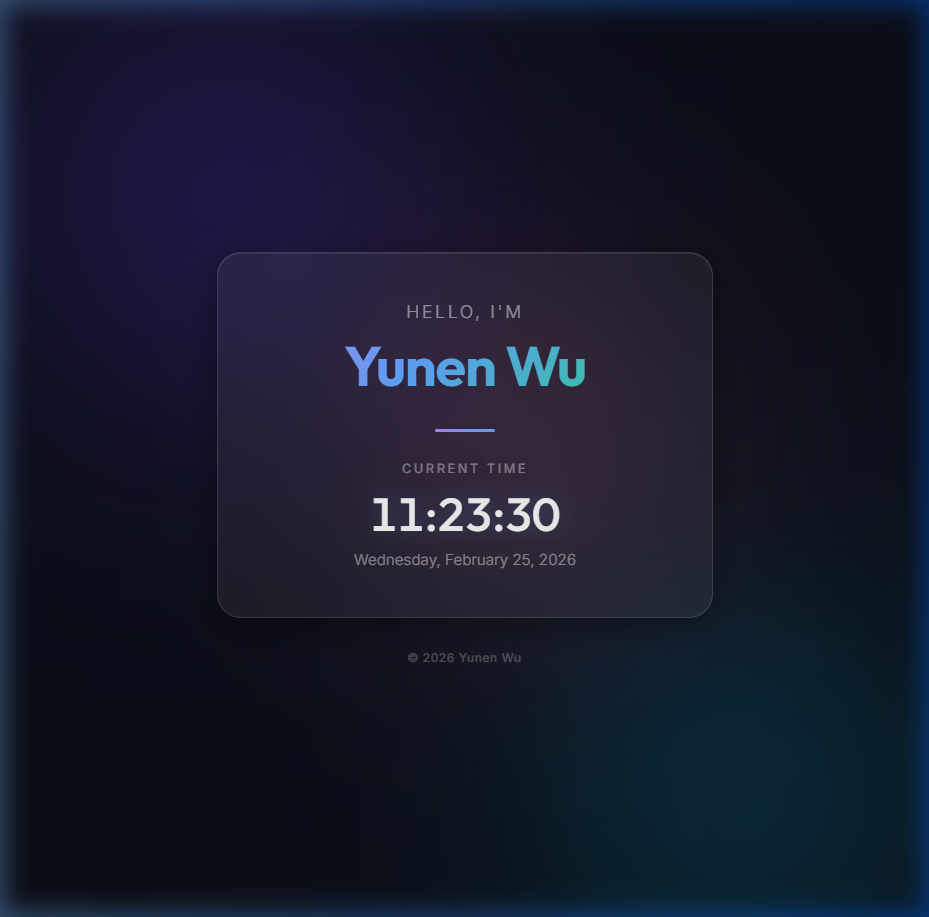

# Project Summary - February 25, 2026

I have successfully designed, built, and deployed a premium personal single-page website for **Yunen Wu**.

## Demo
Local Link: [file:///D:/L1/index.html](file:///D:/L1/index.html)

## 1. Web Development
I created a modern, visually stunning single-page application with the following components:
- **index.html**: Semantic structure featuring a landing card for the user's name and a real-time clock.
- **style.css**: A premium dark-mode design system using:
    - **Glassmorphism**: A frosted-glass card effect with background blur.
    - **Dynamic Background**: Animated gradient "blobs" that float subtly behind the content.
    - **Modern Typography**: Integrated Google Fonts (Outfit and Inter).
    - **Micro-animations**: Smooth entrance transitions for all elements.
- **script.js**: A lightweight script to power a real-time digital clock and date display.

## 2. Result

## 3. Verification
- Verified the website locally using a browser subagent.
- Confirmed that the name "Yunen Wu" is prominent and the clock updates accurately every second.
- Captured screenshots to ensure the design meets high-quality aesthetic standards.

## 3. GitHub Deployment
- **Repository**: [https://github.com/enwu03/0225DRL_class1](https://github.com/enwu03/0225DRL_class1)
- **Actions taken**:
    - Initialized a Git repository in `d:\L1`.
    - Configured Git with username `enwu03` and email `enyunwu03@gmail.com`.
    - Committed all source files (`index.html`, `style.css`, `script.js`).
    - Successfully pushed the code to the `main` branch.
    - Verified the repository contents via browser.

---
*Created by Antigravity*
